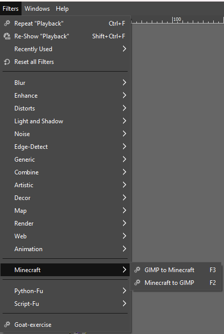
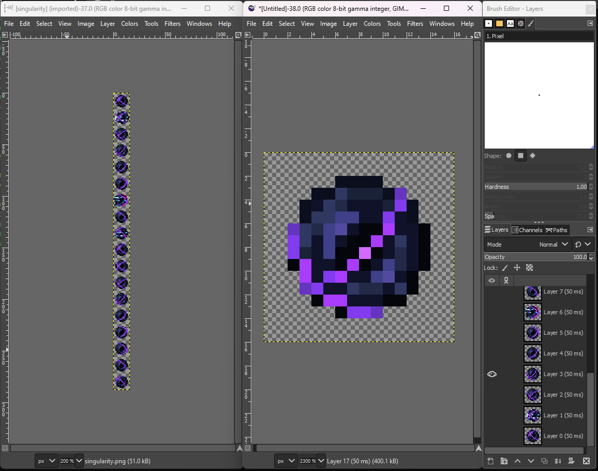

# GIMP to Minecraft

The two scripts here can be loaded as Python-Fu plugins into GIMP 2.10 to
convert between Minecraft's animated textures and a layered image that is easier
to work with in GIMP.

Find your GIMP directory and put the Python scripts in the plug-ins
subdirectory.

On Windows, the path will look something like:
```
C:/Users/USER/AppData/Roaming/GIMP/2.10/plug-ins/
```

## Installation

If you are lazy, you can simply clone this project into the plugins directory.
```
cd path/to/GIMP/2.10/plug-ins

git clone git@github.com:omgimanerd/gimp-to-minecraft .
```

Alternatively, you can just grab the file contents directly.
```
cd path/to/GIMP/2.10/plug-ins

curl https://raw.githubusercontent.com/omgimanerd/gimp-to-minecraft/refs/heads/master/gimp_to_minecraft.py -o gimp_to_minecraft.py

curl https://raw.githubusercontent.com/omgimanerd/gimp-to-minecraft/refs/heads/master/minecraft_to_gimp.py -o minecraft_to_gimp.py
```

## Usage

Once you've copied the scripts into your plugins directory, they are available
under the Filters menu:



I have them bound to keyboard shortcuts for ease of use, which you can do under
`Edit > Keyboard Shortcuts`

Invoke the `Minecraft to GIMP` script on a Minecraft style animated texture
will slice the texture into layers which you can then edit and preview using
GIMP's animation tooling.

### Example:



Using AE2's singularity texture as an example, invoking the script on the left
image generates the image on the right, with each frame sliced into layers.
You can then use `Filters > Animation > Playback` to preview the animation, and
each frame becomes its own separate layer for editing.

The `GIMP to Minecraft` script does the opposite, and takes a GIMP image with
layers as animation and stacks them back into the Minecraft animated texture.

## Author
omgimanerd
